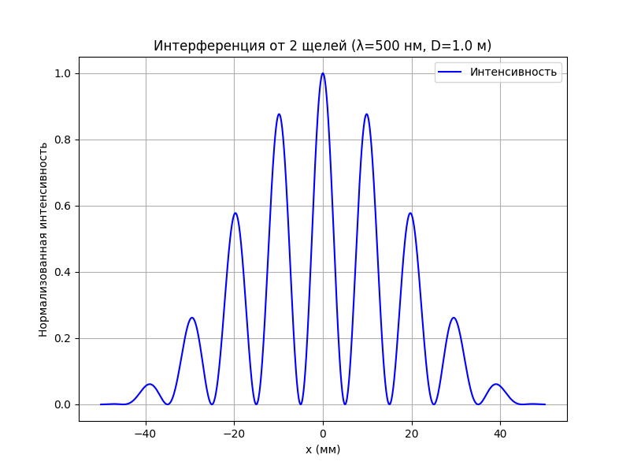

# 📊 Моделирование интерференции от N щелей

Проект позволяет визуализировать интерференционную картину от системы из N щелей. Поддерживает два типа света:
- **Монохроматический** (одна длина волны)
- **Квазимонохроматический** (спектр длин волн)

 


---

## 📚 Теоретические основы

### Формула интенсивности
Интенсивность в точке экрана:
$$ I(x) = \left( \frac{\sin \beta}{\beta} \right)^2 \cdot \left( \frac{\sin (N \alpha)}{\sin \alpha} \right)^2 $$

где:
- $\beta = \frac{\pi a x}{\lambda D}$ — параметр дифракции на щели
- $\alpha = \frac{\pi d x}{\lambda D}$ — параметр интерференции
- $a$ — ширина щели (мкм)
- $d$ — период решётки (мкм)
- $N$ — число щелей
- $\lambda$ — длина волны (нм)
- $D$ — расстояние до экрана (м)

---

## ⚙️ Параметры моделирования
| Параметр        | Описание                          | Диапазон/Пример     |
|-----------------|-----------------------------------|---------------------|
| `N`             | Количество щелей                  | 1-10                |
| `a`             | Ширина щели                       | 10 мкм             |
| `d`             | Период решётки                    | 50 мкм             |
| `D`             | Расстояние до экрана              | 1.0 м              |
| `λ`             | Длина волны                       | 500 нм             |
| `Δλ`            | Ширина спектра                    | 10 нм (для квазимонохроматического) |

---

## 🎨 Визуализация
**Цветовая схема:**
```python
# Синий (0,0,255) → Красный (255,0,0)
blue = int(255 * (1 - intensity))
red = int(255 * intensity)
Особенности:

Нормализация интенсивности к максимуму

Линейная интерполяция цвета

Разрешение 1000 точек по горизонтали

🧮 Пример расчёта
Для параметров:

python
N = 2, λ = 500 нм, D = 1.0 м, a = 10 мкм, d = 50 мкм
Результаты:

Расстояние между максимумами:
Δ
x
=
λ
D
d
=
10
 мм
Δx= 
d
λD
​
 =10 мм

Первый нуль дифракции:
x
n
u
l
l
=
λ
D
a
=
50
 мм
x 
null
​
 = 
a
λD
​
 =50 мм

🚀 Запуск программы
Установите зависимости:

bash
pip install numpy opencv-python matplotlib
Настройте параметры в коде:

python
# Основные параметры
N = 2
a = 10      # мкм
d = 50      # мкм
lambda_ = 500 # нм
D = 1.0     # м
Запустите скрипт:

bash
python interference.py
Результаты сохранятся в файлах:

intensity_plot.png — график интенсивности

intensity_distribution.png — цветная картина
